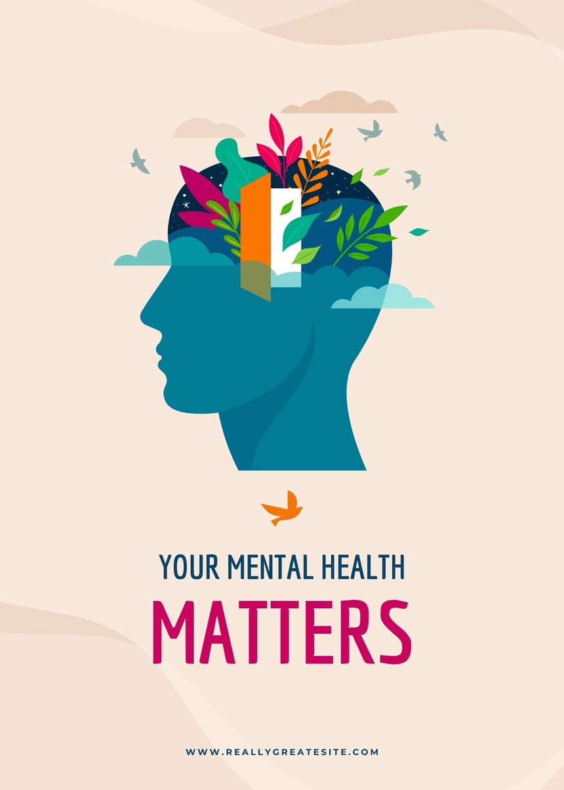

# 🧠 Mental Health Risk Prediction App



This is a Streamlit web application that predicts the **risk of depression or mental health issues** based on user input. It uses a trained machine learning model (`best_model.pkl`) and provides:
- A simple UI for input
- Prediction result (high/low risk)
- SHAP explainability
- Custom visualizations
- Report generation in HTML

---

!(assets/screenshot.png) 

---

## 📁 Project Structure

Mental-Health-Risk-Prediction/
├── app.py # Streamlit app
├── best_model.pkl # Trained ML model
├── train.csv # Training dataset
├── test.csv # Test dataset
├── test_predictions.csv # Optional prediction output
├── prediction_report.html # HTML report after prediction
├── requirements.txt # Python dependencies
└── README.md # Project documentation

yaml
Copy
Edit

---

## ⚙️ Installation


---

## ⚙️ Installation

1. **Clone the repository**
```bash
git clone https://github.com/your-username/mental-health-predictor.git
cd mental-health-predictor

cd mental-health-predictor
(Optional) Create and activate a virtual environment

bash
Copy
Edit
python -m venv venv
venv\Scripts\activate     # On Windows
# OR
source venv/bin/activate  # On macOS/Linux
Install dependencies

bash
Copy
Edit
pip install -r requirements.txt
🧪 Run the App
bash
Copy
Edit
streamlit run app.py
The app will open in your default web browser at http://localhost:8501

🧠 Model Details
The model is trained on features like:

Age, Gender, CGPA

Academic and Work Pressure

Sleep Duration

Study & Job Satisfaction

Suicidal Thoughts

Work/Study Hours

Family History of Mental Illness

Dietary Habits

Preprocessing includes:

Label Encoding for categorical features

Standard Scaling for numerical features

Model type: RandomForestClassifier (or your actual model)

📈 Features
Predicts high or low mental health risk

Interactive UI with sliders and dropdowns

Saves an HTML report of each prediction

SHAP explainability: shows top contributing features

Visual summaries:

Bar chart for stress and satisfaction levels

Pie chart of time spent (sleep/study/other)

Optional data visualizations from train.csv

📦 Dependencies
streamlit

pandas

numpy

scikit-learn

shap

matplotlib

seaborn

joblib

Install using:

bash
Copy
Edit
pip install -r requirements.txt
📌 TODO / Improvements
 Add option to download report as PDF

 Deploy to Streamlit Cloud for public access

 Support user authentication and session history

 Store prediction history in local database (CSV or SQLite)

 Add Hugging Face or cloud-based model loading

📝 License
This project is licensed under the MIT License.

🙏 Acknowledgments
Streamlit for the UI framework

SHAP for model interpretability

Kaggle & public datasets for mental health

Scikit-learn for training and preprocessing

👤 Author
Sushant Kumar
Freelance ML Engineer | India
📧 basiccoding.ml@gmail.com
🔗 LinkedIn (replace with your actual link)
🐍 Passionate about ML, NLP, and building intelligent systems.

yaml
Copy
Edit

---

Let me know if you also want:
- `requirements.txt` generated from your project
- Help deploying this to Streamlit Cloud


Ask ChatGPT
